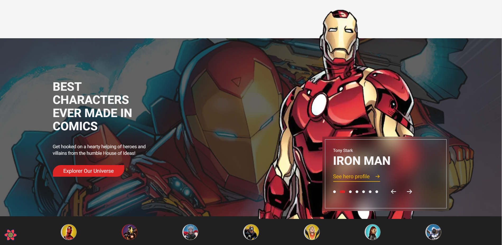
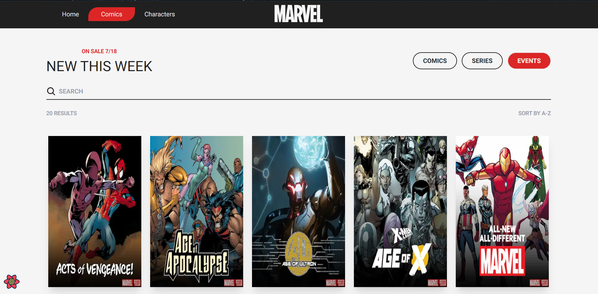
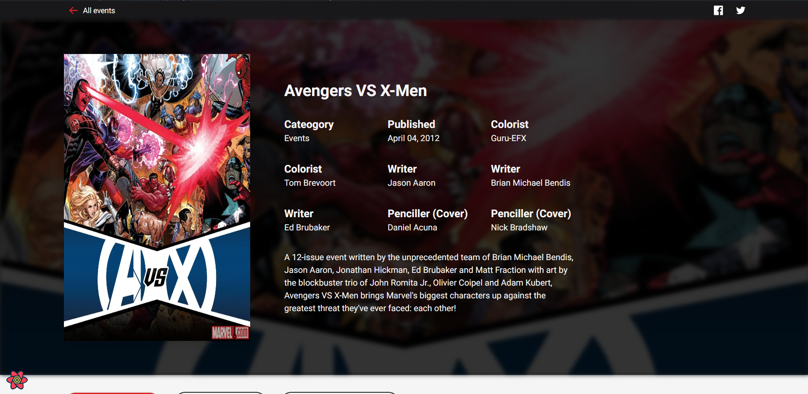
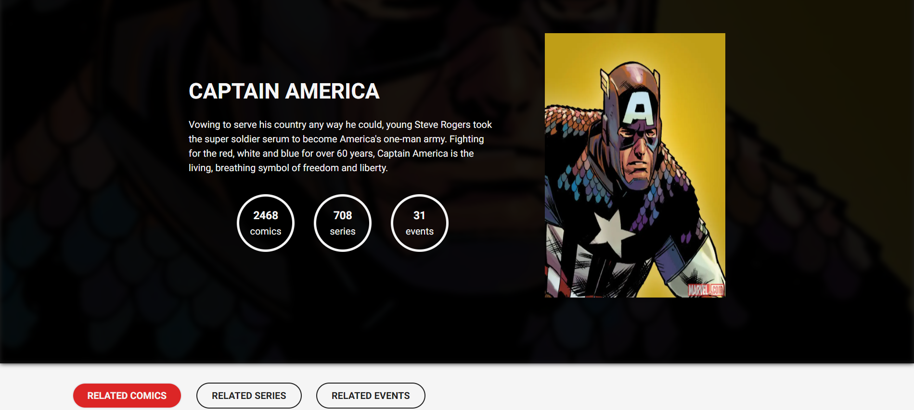

<h1 align="center">
    Marvel Comics Website 🦸
</h1>

<div align="center">
   <a href="https://github.com/JohnPetros">
      
   </a>
   
   <a href="https://github.com/JohnPetros/marvel-comics-website/commits/main">
      
   </a>
  </a>
   </a>
   <a href="https://github.com/JohnPetros/marvel-comics-website/blob/main/LICENSE.md">
      
   </a>
    
</div>
<br>

## 🖥️ About the App

This is a website about the **Marvel Comics** using their API whose full documentation can be find on this oficial [site](https://developer.marvel.com/).

The motivation for creating this project was to practice the basics of [React Query](https://tanstack.com/query/v3/), which is a powerful state management library and also the features of [Next.js](https://nextjs.org/) Version 13, such as server and client components, file-system based router, dynamic routes, error handling, fetching data etc.

### ⏹️ Demonstration

<table align="center">
  <tr>
    <td align="center" width="700">
    <span>Home page <br/></span>
    
    </td>
  </tr>
  <tr>
    <td align="center" width="700">
      <span>Comics page <br/></span>
        
    </td>
  </tr>
  <tr>
    <td align="center" width="700">
      <span>Comic details page<br/></span>
      
    </td>
  </tr>
  <tr>
    <td align="center" width="700">
      <span>Character details page<br/></span>
      
    </td>
  </tr>
</table>

---

## ✨ Features

- [x] List all Marvel comics and characters 👊.
- [x] Filter comics by "category" (`comics`, `series` or `events`).
- [x] Filter comics by name.
- [x] Add infinite scroll to comics and characters list.
- [x] Filter characters by name.
- [x] Display details page of a comic/character by clicking on one of them.
- [x] On this page list related comics or characters to a specific comic or character.
- [x] Add pagination to related comics/characters list.
- [x] Filter related comics by "category" (`comics`, `series` or `events`).
- [x] Filter related comics/characters by name.
- [] Show variants comics of a specific comic (if it has at least one).

---

## 🛠️ Technologies

This app was developed using the following technologies:

✔️ **[ReactJs](https://react.dev/)**

✔️ **[Next.js](https://nextjs.org/)**

✔️ **[TypeScript](https://www.typescriptlang.org/)**

✔️ **[Framer Motion](https://www.framer.com/motion/)**

✔️ **[TailwindCSS](https://tailwindcss.com/)**

✔️ **[RadixUi](https://www.radix-ui.com/)**

✔️ **[Lottie](https://lottiefiles.com/)**

---

## 🚀 How to run this app?

### Prerequisites

You will need a package manager like [npm](https://www.npmjs.com/) or [yarn](https://yarnpkg.com/) to run the application.

#### 📟 Running the application

```bash

# Clone this repo
$ git clone https://github.com/JohnPetros/marvel-comics-website.git

# Access the app's folder
$ cd marvel-comics-website

# Install the dependecies
$ npm install or yarn add

# Set the env viarables in .env.local
BASE_URL=
PUBLIC_KEY=
HASH=
TIMESTAMP=

# Run the app in development mode
$ npm run dev or yarn dev

# Probably the app will runnig on http://localhost:3000

```

---

> More about the env variables can be found [here](https://developer.marvel.com/documentation/authorization)

## ⚙️ Deploy

This app was deployed by **[Vercel](https://vercel.com/home)**. This means you can access the running app by accessing this **[link](https://marvel-comics-website-pearl.vercel.app/)**.

---

## 💪 How to contribute

```bash

# Fork this repo
$ git clone https://github.com/JohnPetros/marvel-comics-website.git

# Create a branch with your feature
$ git checkout -b my-feature

# Commit your changes:
$ git commit -m 'feat: My new feature'

# Push to your branch:
$ git push origin my-feature

```

> You also can open a [new issue report](https://github.com/JohnPetros/marvel-comics-website/issues). It will be an honor to be able to help you and improve this application as well.

---

## 📝 License

This app is under MIT lincese. See the [License file](LICENSE) for more details.

---

<p align="center">
   Made with 💜 by John Petros 👋🏻
</p>
